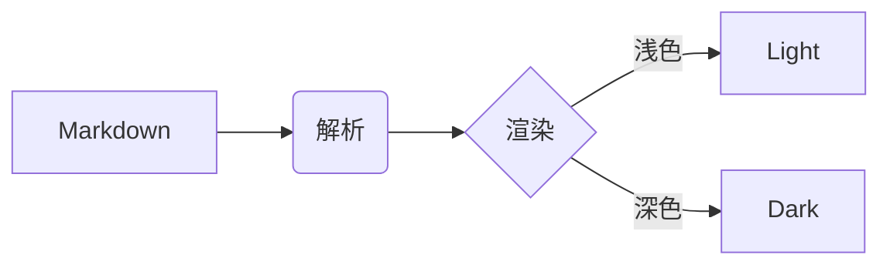
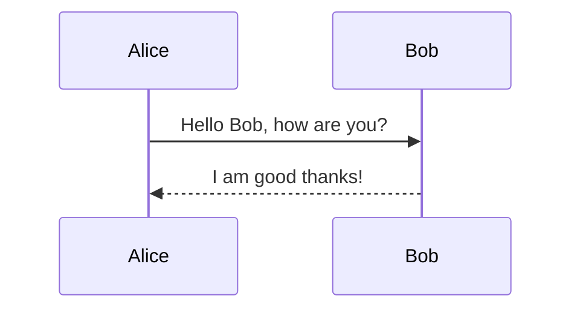

[TOC]

# Heading 1

## Heading 2

### Heading 3

#### Heading 4

##### Heading 5

###### Heading 6

## 段落与行内元素

这是一段普通正文，行高 28px，段间距 16px。正文列宽 980px；换成 `typora-vitepress-fullwidth` 主题即为 fullwidth。

支持 **加粗**、*斜体*、~~删除线~~、`行内代码`、==高亮==、<u>下划线</u>、H~2~O、X^2^，以及 [链接](https://vitepress.dev)、<https://vitepress.dev> 和脚注[^1]。

> 引用块使用 2px 的左边框，颜色比正文浅一档，没有背景色。
>
> > 嵌套引用也一样。

---

## 列表

- 无序列表项一
- 无序列表项二
  - 二级：circle
    - 三级：square
- 无序列表项三

1. 有序列表项一
2. 有序列表项二
   1. 二级：lower-alpha
      1. 三级：lower-roman

- [ ] 未完成的任务
- [x] 已完成的任务

## 表格

| 左对齐 | 居中 | 右对齐 |
| :--- | :---: | ---: |
| col 3 is | some wordy text | $1600 |
| col 2 is | centered | $12 |
| zebra stripes | are neat | $1 |

## 代码

行内代码 `ref()`、`useData()`、`const a = 1`。

```ts
import { ref, computed } from 'vue'

// 行注释
interface User {
  id: number
  name: string
}

const count = ref(0)
const s = "hello"
const n = 42
const t = true

function inc(step = 1): void {
  count.value += step
}

export const double = computed(() => count.value * 2)
```

```js
const sum = (a, b) => a + b
console.log(sum(1, 2))
```

```html
<!DOCTYPE html>
<html>
  <body>
    <p id="demo">Hello</p>
  </body>
</html>
```

```bash
pnpm add -D vitepress
pnpm vitepress dev docs
```

```
没有语言标识的代码块。
```

## 数学公式

行内公式：$E = mc^2$，以及 $\LaTeX$。

$$
\frac{1}{n}\sum_{i=1}^{n}x_i
$$

## Mermaid





## 图片


## 链接定义与脚注

[引用式链接][ref] 也支持。

[ref]: https://vitepress.dev "VitePress 官网"

[^1]: 这是脚注内容。脚注定义同样会被主题配色覆盖。

## 结语

如果上面每一块都符合 VitePress 文档站的观感，主题就安装正确了。
